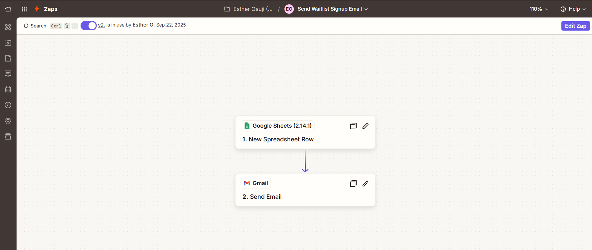
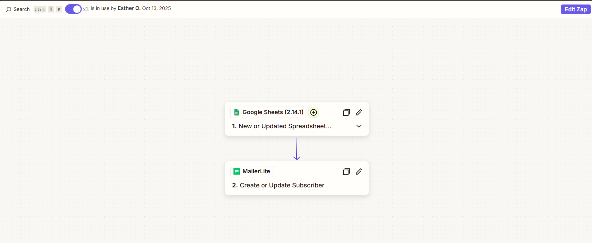
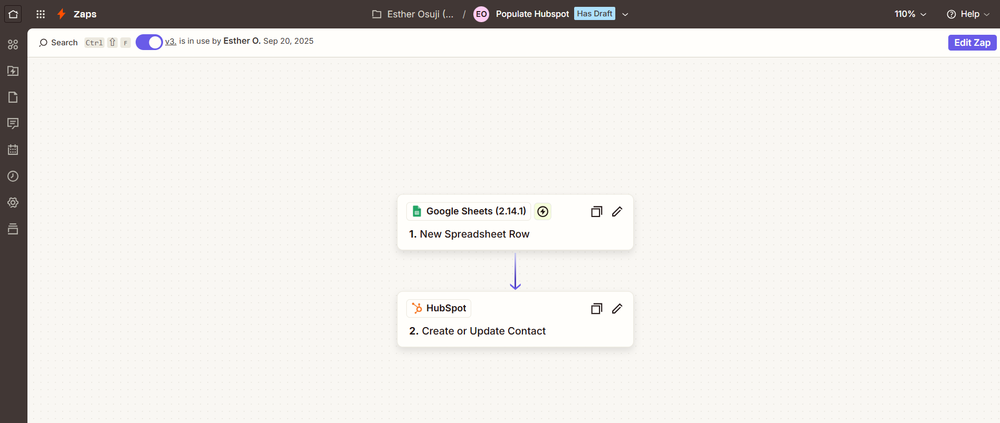
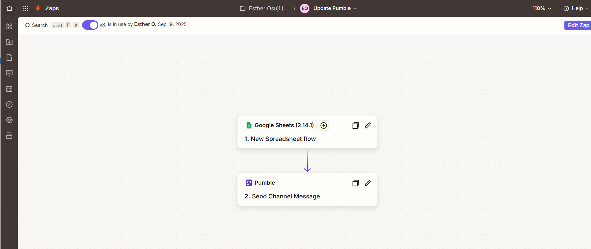
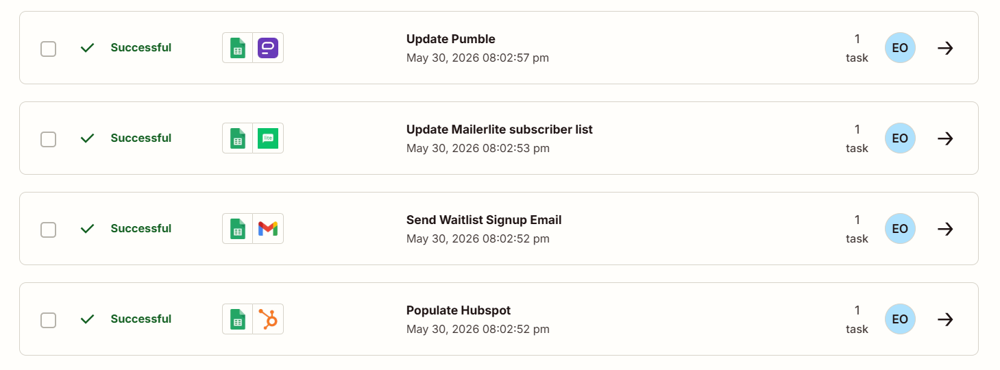

# Automated Lead Capture & Onboarding Workflow

Executive Assistant | CRM & Workflow Automation Specialist project — 
built for an app launch signup process.

## What it does
Automates the full lead capture and onboarding flow — from form 
submission to CRM entry to team notification — with zero manual steps.

## How it works
When a user fills out a Google Form:
1. Their data is instantly captured in Google Sheets
2. A welcome email is sent automatically
3. The lead is added to HubSpot CRM
4. The lead is added to a MailerLite subscriber list
5. The team is notified in real time via Pumble

## Result
Streamlined signups, instant engagement, real-time CRM updates, and 
hours of manual work saved daily.

## Stack
- Zapier (automation/orchestration)
- Google Forms + Google Sheets
- HubSpot CRM
- MailerLite
- Pumble

## Workflow Diagram

## Individual Zap Steps

## Proof of Execution

